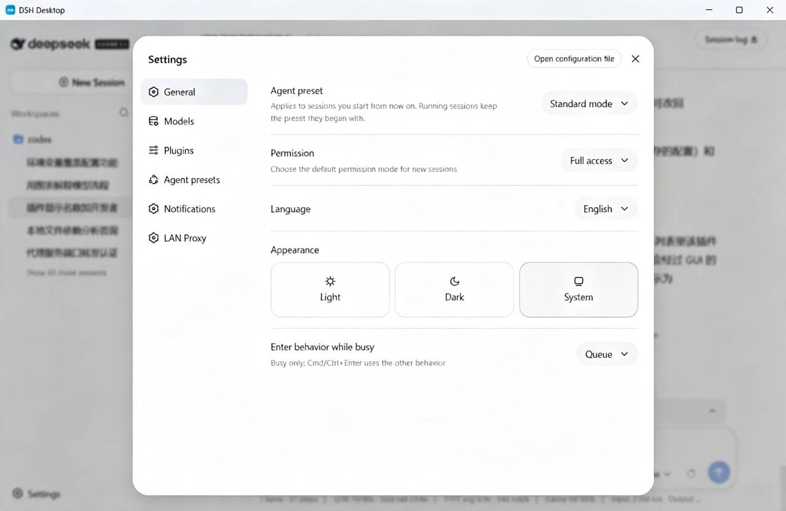

# DSH Desktop Lite

**English** | [中文](README.md)

DSH Desktop is a desktop launcher for [DSH (DeepSeek Harness)](https://github.com/deepseek-ai/dsh). Powered by Tauri 2, it automatically detects and starts the local `dsh web` service and opens its web interface inside the app window.


## Features

- **Lightning fast**: Built natively on Tauri 2 — small installer, low memory footprint.
- **Lightweight entry**: This project is only a launcher/entry point for DSH and does not bundle DSH itself. Install the DSH tool first:

  ```bash
  npm install -g @deepseek-ai/dsh
  ```

- **Auto detection**: On startup, checks whether `dsh web` is already running, on the default port (3080) or any other port that responds with the dsh web page signature.
- **Auto start**: If no running instance is found, it locates the `dsh` command and launches `dsh web --port 3080` automatically — no manual commands needed.
- **In-app browsing**: Once the service is ready, the dsh web interface opens directly inside the app window.
- **Cross-platform**: Supports Windows, macOS and Linux, correctly locating the `dsh` command on every platform.
- **Clean shutdown**: On exit, only the dsh process started by this app is terminated — user-started instances are never killed.

## Screenshots

<p align="center"></p>

## Requirements

- [Node.js](https://nodejs.org/) (20 or later recommended)
- [Rust](https://www.rust-lang.org/) stable
- [Tauri 2 platform prerequisites](https://tauri.app/start/prerequisites/) (compilation dependencies per OS, e.g. WebView2 on Windows, webkit2gtk on Linux)
- DSH tool installed globally (see install command above)

## Development

```bash
# Install dependencies
npm install

# Start development mode (hot reload)
npm run tauri dev
```

## Build & Package

```bash
# Build the installer for the current platform
npm run tauri build
```

Package targets for each platform are configured in `src-tauri/tauri.conf.json`; NSIS (Windows) is used by default.

### Automated Releases (GitHub Actions)

The repository ships a [build-release.yml](.github/workflows/build-release.yml) workflow that can be triggered manually. It builds installers for Windows, macOS and Linux in one go and creates a draft release.

## How It Works

1. On startup, the app calls the `check_dsh` command to check the service status.
2. If dsh is already running (default port 3080, or any listening port responding with the dsh web page signature), it navigates directly.
3. Otherwise it locates the `dsh` command (PATH first, then common install locations), launches `dsh web --port 3080` and polls until it is ready.
4. Once ready, the web interface opens inside the window; on exit, if dsh was started by this app, its process tree is terminated as well.

## Project Structure

```
dsh-desktop
├── src/                    # Frontend (vanilla HTML/CSS/JS)
│   ├── index.html
│   ├── main.js             # Calls Tauri commands and handles navigation
│   └── styles.css
├── src-tauri/              # Tauri backend (Rust)
│   ├── src/
│   │   ├── main.rs
│   │   └── lib.rs          # Core logic: detection, startup, port probing
│   ├── capabilities/
│   └── tauri.conf.json     # App configuration
├── doc/                    # Docs assets (screenshots, etc.)
└── .github/workflows/      # CI builds & releases
```

## Logs

When the app starts dsh, its output is written to `dsh-web.log` under the system app-log directory. If startup fails or times out, check this log to troubleshoot.

## License

This project is open source under the [MIT License](LICENSE).

```
MIT License

Copyright (c) 2026 dsh-desktop contributors

Permission is hereby granted, free of charge, to any person obtaining a copy
of this software and associated documentation files (the "Software"), to deal
in the Software without restriction, including without limitation the rights
to use, copy, modify, merge, publish, distribute, sublicense, and/or sell
copies of the Software, and to permit persons to whom the Software is
furnished to do so, subject to the following conditions:

The above copyright notice and this permission notice shall be included in all
copies or substantial portions of the Software.

THE SOFTWARE IS PROVIDED "AS IS", WITHOUT WARRANTY OF ANY KIND, EXPRESS OR
IMPLIED, INCLUDING BUT NOT LIMITED TO THE WARRANTIES OF MERCHANTABILITY,
FITNESS FOR A PARTICULAR PURPOSE AND NONINFRINGEMENT. IN NO EVENT SHALL THE
AUTHORS OR COPYRIGHT HOLDERS BE LIABLE FOR ANY CLAIM, DAMAGES OR OTHER
LIABILITY, WHETHER IN AN ACTION OF CONTRACT, TORT OR OTHERWISE, ARISING FROM,
OUT OF OR IN CONNECTION WITH THE SOFTWARE OR THE USE OR OTHER DEALINGS IN THE
SOFTWARE.
```
