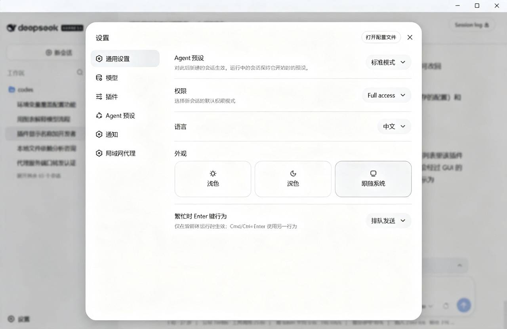

# DSH Desktop 轻量版

[English](README.en.md) | **中文**

DSH Desktop 是 [DSH（DeepSeek Harness）](https://github.com/deepseek-ai/deepseek-harness) 的桌面启动器。它由 Tauri 2 驱动，会自动检测、启动本机的 `dsh web` 服务，并在应用窗口内打开其 Web 界面。

## 功能特性

- **极速体验**：基于 Tauri 2 原生实现，安装包体积小(2M)，运行内存占用低（10M）。
- **轻量入口**：本项目仅是 DSH 的启动器与入口，不包含 DSH 本体。请先自行安装 DSH 工具：

  ```bash
  npm install -g @deepseek-ai/dsh
  ```

- **自动检测**：启动时检测本机是否已有 `dsh web` 在运行，支持默认端口（3080）以及任意其他端口上的实例。
- **自动启动**：未检测到运行时，会自动查找并拉起 `dsh web --port 3080`，无需手动敲命令。
- **界面跳转**：服务就绪后，在应用窗口内直接打开 dsh 的 Web 界面。
- **跨平台**：支持 Windows、macOS、Linux，并在多平台下都能正确找到 `dsh` 命令。
- **移动端**：支持打包 Android APK 与 iOS 应用。手机端不启动本地服务，而是输入局域网内电脑的 IP 地址和端口，直接连接已运行的 `dsh web`（上次地址会被记住并自动连接）。
- **干净退出**：应用退出时只会结束由它自己启动的 dsh 进程，不会误杀用户自己启动的实例。

## 下载

前往 [GitHub Releases](https://github.com/smanx/dsh-desktop/releases) 下载对应平台的安装包。

## 界面预览

<p align="center"></p>

## 环境要求

- [Node.js](https://nodejs.org/)（建议 20 或更高）
- [Rust](https://www.rust-lang.org/) 稳定版
- [Tauri 2 平台依赖](https://tauri.app/start/prerequisites/)（各系统编译所需，如 Windows 的 WebView2、Linux 的 webkit2gtk 等）
- 已全局安装 DSH 工具（见上文安装命令）

## 开发

```bash
# 安装依赖
npm install

# 启动开发模式（热重载）
npm run tauri dev
```

## 构建与打包

```bash
# 构建当前平台的安装包
npm run tauri build
```

各平台对应的打包目标由 `src-tauri/tauri.conf.json` 配置，目前默认使用 NSIS（Windows）。

### 自动发布（GitHub Actions）

仓库内置了 [build-release.yml](.github/workflows/build-release.yml) 工作流，可手动触发，会同时构建 Windows、macOS、Linux 三个平台的安装包，并生成草稿版本（draft release）。

### 手机端打包（GitHub Actions）

同一工作流会在 CI 上自动产出手机包，本地无需安装 Android/iOS 环境：

- **Android**：`build-android` job 构建 arm64 架构的 **Release 签名 APK**（zipalign + apksigner 对齐签名，可直接安装、支持覆盖升级），并作为 `*.apk` 附件上传到 GitHub Release。签名材料全部通过 GitHub Secrets 注入，需在仓库 **Settings → Secrets and variables → Actions** 配置：

  | Secret | 说明 |
  |---|---|
  | `ANDROID_KEYSTORE_BASE64` | keystore 文件的 base64 编码 |
  | `ANDROID_KEYSTORE_PASSWORD` | keystore 密码 |
  | `ANDROID_KEY_ALIAS` | key 别名（可选，默认 `dsh-desktop`） |

  本地生成 keystore 并得到 base64（Windows PowerShell）：

  ```powershell
  & "$env:JAVA_HOME\bin\keytool.exe" -genkeypair -v -keystore dsh-release.keystore `
    -storetype PKCS12 -alias dsh-desktop -keyalg RSA -keysize 2048 -validity 10000 `
    -storepass "你的密码" -dname "CN=dsh-desktop, C=CN"
  [Convert]::ToBase64String([IO.File]::ReadAllBytes("dsh-release.keystore")) # 复制输出填入 Secret
  ```

  macOS/Linux 用 `base64 -i dsh-release.keystore`。**务必备份 keystore 文件**：丢失后无法再用同一签名发布更新。
- **iOS**：`build-ios` job 构建 iOS 模拟器包（`.app` 压缩为 zip），仅上传为 workflow artifact。真机安装需要苹果开发者证书签名，暂未包含；如需分发可后续在 CI 中接入签名证书（Secrets）。
- **图标**：两个 job 在 init 后都会执行 `tauri icon app-icon.png`，Android 启动器图标、iOS AppIcon 与桌面端图标全部由同一张 `app-icon.png` 生成，保持一致。

手机端使用说明：手机与电脑连接同一网络，在电脑上运行 `dsh web --port 3080`，然后在 App 中输入电脑的局域网 IP（如 `192.168.1.100`）和端口即可打开 dsh 界面。为支持明文 HTTP 连接，移动端构建已启用 Android 明文流量（含 release 构建，由 [.github/scripts/patch-mobile.sh](.github/scripts/patch-mobile.sh) 在 CI 中自动打补丁）与 iOS ATS 例外。

## 工作原理

1. 应用启动后调用 `check_dsh` 命令检测服务状态。
2. 若发现 dsh 已在运行（默认端口 3080，或任意已监听且返回 dsh Web 页面特征的端口），直接跳转。
3. 否则查找 `dsh` 命令（优先 PATH，再探测常见安装目录），执行 `dsh web --port 3080` 拉起服务并轮询等待就绪。
4. 服务就绪后窗口内打开 Web 界面；退出时若 dsh 是由本应用启动的，则一并结束其进程树。

**移动端**：不检测、不启动本地进程。启动后显示连接表单（IP 地址 + 端口），调用 `connect_remote` 探测目标是否为 dsh 服务，确认后直接在应用内打开远端界面；上次输入的地址会保存在本地并自动重连。

## 项目结构

```
dsh-desktop
├── src/                    # 前端页面（原生 HTML/CSS/JS）
│   ├── index.html
│   ├── main.js             # 调用 Tauri 命令并处理界面跳转
│   └── styles.css
├── src-tauri/              # Tauri 后端（Rust）
│   ├── src/
│   │   ├── main.rs
│   │   └── lib.rs          # 核心逻辑：检测、启动、端口探测
│   ├── capabilities/
│   └── tauri.conf.json     # 应用配置
├── doc/                    # 文档相关资源（界面截图等）
└── .github/                # CI 构建发布工作流 + 移动端工程补丁脚本
```

## 日志

应用启动 dsh 时会将输出写入系统应用日志目录下的 `dsh-web.log`。若启动失败或超时，可查看该日志排查问题。

## 许可

本项目基于 [MIT License](LICENSE) 开源。

```
MIT License

Copyright (c) 2026 dsh-desktop contributors

Permission is hereby granted, free of charge, to any person obtaining a copy
of this software and associated documentation files (the "Software"), to deal
in the Software without restriction, including without limitation the rights
to use, copy, modify, merge, publish, distribute, sublicense, and/or sell
copies of the Software, and to permit persons to whom the Software is
furnished to do so, subject to the following conditions:

The above copyright notice and this permission notice shall be included in all
copies or substantial portions of the Software.

THE SOFTWARE IS PROVIDED "AS IS", WITHOUT WARRANTY OF ANY KIND, EXPRESS OR
IMPLIED, INCLUDING BUT NOT LIMITED TO THE WARRANTIES OF MERCHANTABILITY,
FITNESS FOR A PARTICULAR PURPOSE AND NONINFRINGEMENT. IN NO EVENT SHALL THE
AUTHORS OR COPYRIGHT HOLDERS BE LIABLE FOR ANY CLAIM, DAMAGES OR OTHER
LIABILITY, WHETHER IN AN ACTION OF CONTRACT, TORT OR OTHERWISE, ARISING FROM,
OUT OF OR IN CONNECTION WITH THE SOFTWARE OR THE USE OR OTHER DEALINGS IN THE
SOFTWARE.
```
